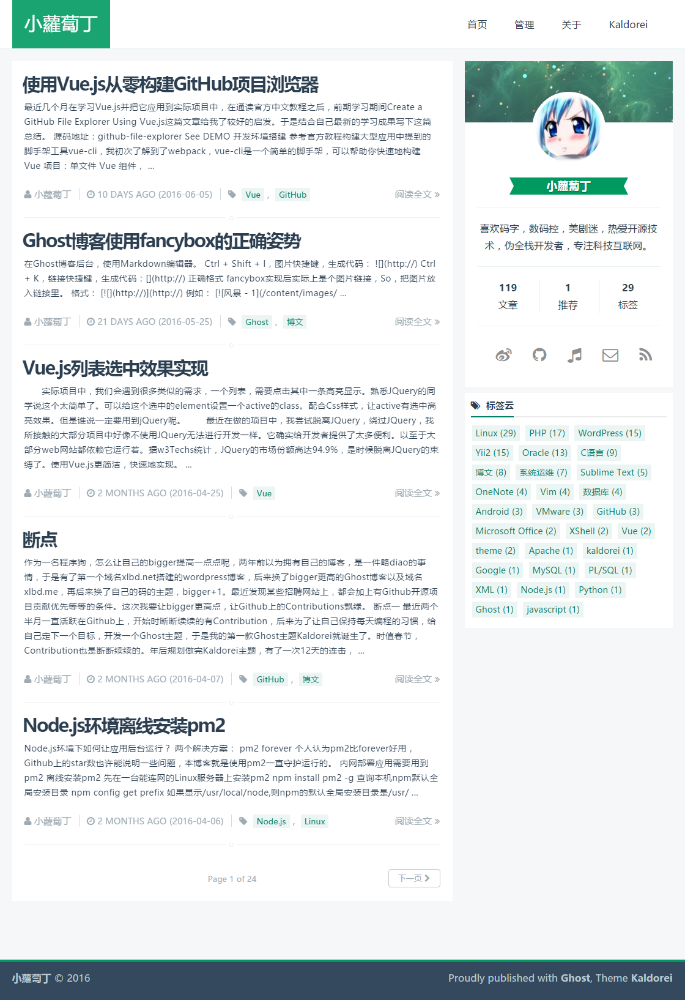

# Kaldorei
A Simple And Elegant Ghost Theme Derive From Default Theme Casper

# Preview



## Plan to do
- [x] 主题基调定为小清新绿色

- [x] 文章样式色调为墨蓝色，参考 [[马克飞象]](http://maxiang.io)

- [x] 返回顶部

- [x] 代码高亮

- [x] 侧边栏 - 标签云

- [x] 侧边栏 - 文章目录

- [x] 侧边栏 - 站点信息

- [x] 侧边栏 - 作者信息

- [x] 文章栏 - 作者信息

- [x] 首页加载文章动画

- [x] 响应式设计

- [x] 归档功能

- [x] 图片暗箱效果

- [ ] 全局搜索

- [ ] 延迟加载

- [ ] 推荐文章置顶

- [ ] 文章回复数统计

## How to use

### 统计
Kaldorei使用了ghost的api来做统计，所以需要开启ghost的实验室中的`Public API`功能。

> 方法：ghost后台 > `labs` > `Enable Beta Features` > `勾选 Public API`

### 开启Disqus
Kaldorei支持Disqus讨论插件，只需在后台`代码注入`处添加一段代码。

> 方法：ghost后台 > `Code Injection` > `Blog Header`

```js
<script>
    var disqus_shortname = 'your_disqus_shortname';
</script>
```

### 开启归档功能
Kaldorei提供了简单的归档功能，使用ghost的api来生成归档，预览[博客归档](http://xlbd.me/archives-post)。

> 方法：ghost后台:
> * New Post > 标题输入`Archives`，这时文章的地址默认为`archives-post`;
> * Post Settings > 勾选`Turn this post into a static page`，然后Publish;
> * Navigation > 创建一个`归档`导航，地址为：http://your_blog_url/`archives-post`;
> * 去博客首页看看你的归档吧，Have fun.

## About ghost helpers

Kaldorei用两种方法实现了标签云，方法参见[我的博客](http://xlbd.me/how-to-add-the-tag-cloud-into-ghost-blog/)。

Kaldorei优化了发布文章的时间展示，并汉化为中文，需要修改时间(date)助手，方法参见[我的博客](http://xlbd.me/ghost-date-i18n/)。

## Credit

* [font-awesome](https://github.com/FortAwesome/Font-Awesome)
* [bootstrap](https://github.com/twbs/bootstrap)
* [highlight.js](https://github.com/isagalaev/highlight.js)
* [velocity.js](https://github.com/julianshapiro/velocity)
* [jquery.toc.js](https://github.com/jgallen23/toc)
* [anijs](https://github.com/anijs/anijs)
* [jquery.githubRepoWidget.js](https://github.com/JoelSutherland/GitHub-jQuery-Repo-Widget)
* [fancyBox](https://github.com/fancyapps/fancyBox)
